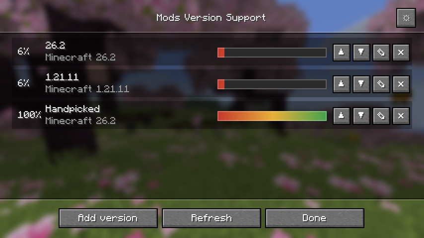

# Mods Version Support

A client-side Fabric mod for Minecraft 26.1.2. It answers one question: if this instance moved
to a newer Minecraft version, which of the installed mods would come along?



## What it does

- Reads the mods of the running instance and identifies them on Modrinth by the SHA-1 of their jar.
- Keeps a list of **version entries**. Each entry pairs a target Minecraft version with the mods
  to check against it. The same version may appear in several entries with different mod sets.
- Checks every entry in the background. While a check runs the row is greyed out, carries a
  spinner and a grey progress bar; the red-amber-green gradient appears once the result is in.
- Shows per mod whether it is ready, only has a prerelease, has nothing for that version, or is
  unknown to Modrinth. The list sorts by availability, name or source.
- Adds mods that are not installed through a Modrinth search with autocomplete and icons.

## Using it

Open the overview through Mod Menu, the client command `/modsversionsupport`, or a key you bind
yourself under Controls. Add an entry with the plus button, pick a Minecraft version from the
dropdown or by typing, and choose which mods take part.

Minecraft versions come from Mojang's `version_manifest_v2.json`, the same list a launcher shows.
Snapshots appear once they are enabled in the settings.

## Building

```
./gradlew build
```

The jar lands in `build/libs`. `./gradlew installToPrism` copies it into the Prism Launcher
instance for this Minecraft version; pass `-Pprism_instance_dir=…` for a different path.

Requirements: JDK 25 or newer, Gradle wrapper included. The build uses the non-remapping
`net.fabricmc.fabric-loom` plugin, since 26.1 ships unobfuscated.

## Tests

```
./gradlew test              # domain, storage, gateways, check engine
./gradlew runClientGameTest # drives the screens and writes screenshots to run/screenshots
```

The client game tests open every screen, type into the autocomplete fields and record what the
game draws.

## Dependencies

Fabric API is required. Mod Menu and Cloth Config are optional: without them the entry in the
mod list and the settings screen are missing, everything else works. The webp decoder for
Modrinth icons ships inside the jar.
